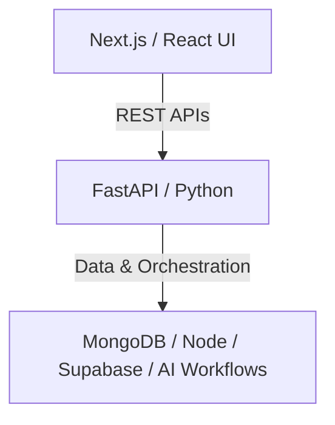

# Samra Shafiq

> *"I believe engineering is one of the most creative disciplines in the world. Where others see rigid logic, I see the bridge between fantasy and reality—a craft that lets you take an abstract idea, find a real-world problem, and build a solution out of thin air."*

I am a self-taught AI web engineer based in Karachi, Pakistan, building software in public and exploring the boundary where human-centric UI meets autonomous backend logic.

---

### ⚡ What I'm Building

#### 📖 [Warraq (ورّاق)](https://github.com/samra82/Warraq)
* **The Problem:** Standard digital publishing and book formatting engines (like Atticus) are engineered strictly around Left-to-Right (LTR) typographies. They break text flow, ligature integrity, and page layout logic when handling complex Right-to-Left (RTL) scripts.
* **The Solution:** A dedicated typesetting and layout engine built specifically for RTL authors, publishers, and calligraphic scripts to give them first-class control over their publications.
* **Stack:** Next.js, TypeScript, Tailwind CSS, Python, FastAPI

#### 🤖 Autonomous Systems & UI Engineering
* **Focus:** Crafting autonomous AI agents, multi-step loop architectures, and bespoke user interfaces that make complex AI workflows feel seamless and intuitive.

---

### 🔨 Featured Projects

#### 🎨 [Frame2Code](https://github.com/samra82/Frame2Code) · [Kaggle Writeup](https://www.kaggle.com/competitions/gemini-3/writeups/Frame2Code-writeup)
* **The Problem:** Translating hand-drawn UI wireframes into functional frontend components manually creates friction during rapid prototyping.
* **The Solution:** A multimodal AI tool built for the Google DeepMind hackathon on Kaggle that turns paper sketches and hand-drawn layout diagrams directly into clean, animated Next.js code.
* **Stack:** Next.js, Tailwind CSS, Python, Gemini Multimodal APIs

---

### 🛠️ Architecture & Tech Stack

My core day-to-day workflow centers around building responsive, highly animated frontends in **Next.js** and pairing them with high-performance **Python + FastAPI** backends.

---
| Domain | Technologies |
| :--- | :--- |
| **Languages** | Python, TypeScript, JavaScript, C, C++, HTML, CSS |
| **Frontend & UI** | Next.js, React, Tailwind CSS, Framer Motion, shadcn/ui, Vite |
| **Backend & APIs** | FastAPI, Node.js, Express, REST APIs, Postman |
| **Databases & CMS** | MongoDB, Sanity |
| **Design & Tooling** | Figma, Git, Linux / WSL |

---

### 🌐 Connect & Build In Public

I document my product development, technical architecture choices, and operational challenges publicly as I build.

* 💼 **LinkedIn:** [linkedin.com/in/samrashafiq](https://www.linkedin.com/in/samrashafiq/)
* 🐙 **GitHub:** [@samra82](https://github.com/samra82)

---

  <i>"Identify a problem in the world, and get its solution into reality with code."</i>

